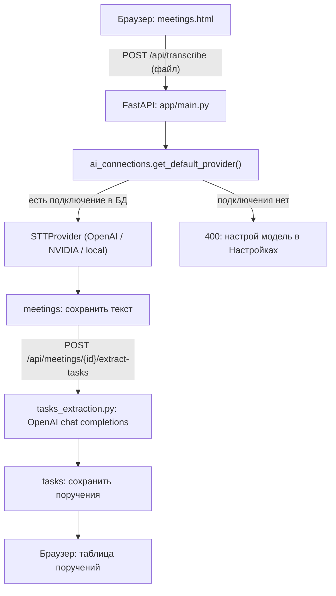

# Jinalys AI — автопротоколирование совещаний

Хакатонный проект по кейсу **«Система автопротоколирования совещаний с фиксацией поручений»**.

Jinalys AI разрабатывается для секретарей совещаний, руководителей и ответственных за исполнение поручений. Ручное составление протоколов занимает время и создаёт риск потерять или неверно записать задачу, срок и ответственного. Цель — превращать запись совещания в текст и структурированный список поручений (ответственный, срок, суть) для последующего контроля.

**Что уже проверено вживую, не только написано в коде:** загрузка аудио через сайт → реальное распознавание речи (OpenAI Whisper API либо NVIDIA Riva, self-hosted `faster-whisper` — следующий шаг) → сохранение текста как совещания → извлечение поручений LLM'ом. Результат сверен с эталонными протоколами из `Тех_задание/` — текст и список поручений совпадают почти дословно.

## Что реализовано

| Компонент | Состояние | Где смотреть |
| --- | --- | --- |
| Загрузка аудио на сайте → распознавание | **Работает end-to-end**, проверено на реальных записях | `frontend/meetings.html` → `POST /api/transcribe` |
| Извлечение поручений (LLM) | **Работает**, сверено с эталонным протоколом | `POST /api/meetings/{id}/extract-tasks`, [tasks_extraction.py](backend/app/tasks_extraction.py) |
| Выбор модели распознавания/ИИ | **Работает через интерфейс** — добавление подключения, кнопка "Тест", "Сделать по умолчанию"; без настроенного подключения API честно отказывает (не молчит на `.env`) | `frontend/settings.html` (вкладка «Распознавание речи и ИИ»), [ai_connections.py](backend/app/ai_connections.py) |
| STT-провайдеры | Три реализации одного интерфейса `STTProvider`: `external_openai`, `external_nvidia` (Riva/NVCF), `local` (self-hosted faster-whisper, `large-v3`) | [backend/app/stt/](backend/app/stt/) |
| Вход и журнал доступа | Реальный логин (bcrypt, блокировка после подбора) и логирование каждой попытки входа и действия | [auth.py](backend/app/auth.py), [access_log.py](backend/app/access_log.py) |
| CLI-распознавание | Тот же провайдерный слой, вызывается из консоли | [app/transcribe.py](backend/app/transcribe.py) |
| Приём записей от коннекторов | Авторизованная загрузка, идемпотентная SQLite-очередь, локальный STT-worker | [backend/INGEST.md](backend/INGEST.md) |
| Cisco CMS коннектор | Календарь CMS Scheduler, SIP-ассистент, запись и доставка в приёмник | [integrations/cisco-connector/](integrations/cisco-connector/README.md) |
| Zoom коннектор | Cloud Recording, календарь, RTMS live-аудио с именами участников | [integrations/zoom-connector/](integrations/zoom-connector/README.md) |
| Веб-интерфейс | Вход, дашборд, список/карточка совещаний, поручения, настройки (44 → 23 отобранных вкладки) | [frontend/](frontend/) |
| Материалы для проверки | 2 аудиозаписи + 2 эталонных протокола DOCX | [Тех_задание/](Тех_задание/) |

### Распознавание речи (STT)

Один интерфейс `STTProvider` ([base.py](backend/app/stt/base.py)) и три независимые реализации:

- **`external_openai`** — OpenAI Whisper API (`whisper-1`), ответ `verbose_json` с сегментами и таймкодами. Проверено на обеих тестовых записях, текст совпадает с эталоном.
- **`external_nvidia`** — NVIDIA Riva (`whisper-large-v3`) через NVCF (`grpc.nvcf.nvidia.com`). Требует `ffmpeg` в PATH — Riva принимает только mono WAV/OPUS/FLAC, конвертация из исходного формата идёт перед отправкой. Проверено.
- **`local`** — self-hosted `faster-whisper` (`large-v3`, CTranslate2). Работает полностью в своей инфраструктуре, без обращения к внешним сервисам — устанавливается отдельным `requirements-local.txt`.

Каждый провайдер возвращает одинаковую структуру (`TranscriptResult`: язык + список `TranscriptSegment(start, end, text)`), поэтому весь остальной код (сохранение, показ на фронте) не знает и не должен знать, какая именно модель распознавала речь.

### Извлечение поручений (LLM)

[`tasks_extraction.py`](backend/app/tasks_extraction.py) отправляет текст расшифровки в OpenAI Chat Completions (`gpt-4o-mini`, JSON-режим, `temperature=0`) с промптом, который просит вернуть строго JSON-массив `{"assignee", "task", "deadline"}` и явно запрещает придумывать поручения, которых нет в тексте. Проверено на обеих тестовых записях — извлечённые поручения (ответственный, срок, суть) сверены построчно с эталонными протоколами, совпадение почти полное (включая относительные сроки вроде "до пятницы", "к среде").

### Совещания и поручения — хранение

SQLite-таблицы `meetings` (текст расшифровки, язык, дата) и `tasks` (ответственный, срок, суть, статус, ссылка на совещание) — [`meetings.py`](backend/app/meetings.py). При успешном `/api/transcribe` совещание сразу сохраняется и возвращает `meeting_id`, на который затем ссылается `/api/meetings/{id}/extract-tasks`.

### Управление ИИ-подключениями

По образцу связки "список подключений → карточка → проверка → default", знакомой по подобным разделам корпоративных панелей настроек: подключения (тип, модель, ключ) хранятся в БД, добавляются и переключаются через интерфейс ([`ai_connections.py`](backend/app/ai_connections.py)), без правки `.env` и перезапуска процесса.

- `POST /api/ai-connections` — добавить подключение.
- `POST /api/ai-connections/{id}/test` — собрать провайдера с текущими настройками, поймать ошибку раньше реального запроса.
- `POST /api/ai-connections/{id}/default` — сделать активным.
- Секрет (`api_key`) никогда не отдаётся обратно в `GET`-ответах — только запись поверх.

**Важно для ТЗ:** продуктовый API (`get_default_provider()`) не имеет тихого фолбэка на `.env` — без настроенного подключения он честно возвращает `400`. Фолбэк на `.env` есть только у CLI (`get_default_provider_or_env_fallback()`) — это инструмент разработчика, не часть продукта, иначе каждый пользователь молча расходовал бы личный ключ разработчика.

### Авторизация и журнал доступа

[`auth.py`](backend/app/auth.py): пароли хранятся как bcrypt-хеш, 5 неверных попыток подряд блокируют вход на 15 минут, ответ на "нет такого логина" и "неверный пароль" одинаковый (чтобы нельзя было перебором узнать список существующих учёток). Каждая попытка входа, каждое действие с ИИ-подключениями и каждая расшифровка пишутся в `access_log` ([`access_log.py`](backend/app/access_log.py)) — время, кто, действие, исход, сообщение.

`POST /api/login`, `POST /api/logout`, `GET /api/access-log` — реализованы и проверены через API.

### Веб-интерфейс

Пять страниц, единый стиль (`frontend/css/style.css`, ни одной внешней CSS-библиотеки):

- **`login.html`** — экран входа.
- **`index.html`** — дашборд: метрики, разбивка по языку (ru/kk/mixed), последние совещания, ближайшие сроки.
- **`meetings.html`** — список совещаний **плюс два живых блока**: загрузка аудио с распознаванием и извлечение поручений после него.
- **`meeting.html`** — карточка одного совещания: саммари, таблица поручений, реплики, полная расшифровка.
- **`settings.html`** — 23 вкладки (из 44 разобранных и осознанно урезанных до нужных кейсу): Безопасность целиком, Пользователи и доступ целиком, плюс Почта/ИИ/Внешние системы/Вход/Тема/Версия. Вкладки «Распознавание речи и ИИ» и «Журнал доступа» — не макет, тянут и пишут данные через `frontend/js/api.js`.

### Приём записей и коннекторы

[`backend/INGEST.md`](backend/INGEST.md) — HTTP-приёмник, принимающий готовые записи от внешних коннекторов (идемпотентная SQLite-очередь, локальный STT-worker). Zoom- и Cisco CMS-коннекторы ([integrations/](integrations/)) — отдельные Docker-сервисы команды, описаны в «Настройки → Внешние системы».

## Как это работает



Ключевой принцип, важный для ТЗ: **нет тихого фолбэка на `.env`** в продуктовом API. Если в «Настройках» не добавлена ни одна модель — `/api/transcribe` и `/api/meetings/{id}/extract-tasks` честно возвращают `400` с просьбой настроить модель, а не незаметно тратят ключ разработчика. Фолбэк на `.env` оставлен только у CLI-скрипта `transcribe.py` — это личный инструмент разработчика, не часть продукта.

## Технологии

| Область | Технологии |
| --- | --- |
| Backend API | Python 3.12, FastAPI, uvicorn, SQLite |
| Авторизация | bcrypt, сессии в памяти процесса |
| STT | OpenAI Whisper API (`whisper-1`), NVIDIA Riva (`whisper-large-v3` через NVCF), faster-whisper (self-hosted, `large-v3`) |
| Извлечение поручений | OpenAI Chat Completions (`gpt-4o-mini`), JSON-режим |
| Frontend | HTML, CSS, JavaScript (без сборки/фреймворка) |
| Коннекторы | Python, FastAPI, Docker Compose, SIP/FFmpeg (Cisco), официальный Zoom RTMS SDK |

Зависимости — в [requirements.txt](backend/requirements.txt), [requirements-local.txt](backend/requirements-local.txt) (self-hosted STT).

## Установка и запуск (для проверяющего)

### 1. Клонировать

```bash
git clone https://github.com/BAITC-Hacks/hack-c449499f-socbrain.git
cd hack-c449499f-socbrain
```

### 2. Поднять backend

**Windows (cmd/PowerShell):**

```bat
cd backend
py -3.12 -m venv .venv
.venv\Scripts\activate
python -m pip install -r requirements.txt
copy .env.example .env
```

**macOS / Linux:**

```bash
cd backend
python3.12 -m venv .venv
source .venv/bin/activate
python -m pip install -r requirements.txt
cp -n .env.example .env
```

Завести первого пользователя (нужен для входа и журнала доступа; для сценария "загрузить и распознать" на сайте — не обязателен, эти ручки работают и без входа):

```bash
python seed.py artem "Артём Е." <свой пароль>
```

Запустить сервер:

```bash
uvicorn app.main:app --reload --port 8001
```

Если порт занят (`WinError`/`Address already in use`) — взять другой (`--port 8002`) и поменять `const API_BASE` в [frontend/js/api.js](frontend/js/api.js) на тот же номер.

### 3. Настроить модель распознавания

Открыть [frontend/settings.html](frontend/settings.html) двойным кликом (это статический файл, отдельный сервер не нужен) → вкладка **«Распознавание речи и ИИ»** → форма внизу:

- Тип `external_openai`, модель `whisper-1`, свой `OPENAI_API_KEY` — самый быстрый путь для проверки.
- Или `external_nvidia` (нужен ключ с build.nvidia.com) — тоже облачный, для теста.
- `local_faster_whisper` — self-hosted, требует `pip install -r requirements-local.txt` и GPU/CPU достаточной мощности; модель скачивается при первом запуске (несколько ГБ).

Добавленное подключение сразу становится активным — редактирования пока нет, только добавление новых и переключение "по умолчанию".

### 4. Распознать тестовую запись и извлечь поручения

Открыть [frontend/meetings.html](frontend/meetings.html) → блок «Загрузить и распознать»:

1. Выбрать `Тех_задание/Совещание №1.mp3` → «Распознать» (может занять минуту).
2. После готовности — «Извлечь поручения».
3. Сравнить результат с [Протокол_совещания№1.docx](Тех_задание/Протокол_совещания№1.docx) — эталонный текст и список поручений (ответственный/срок/суть) для сверки.
4. Повторить со второй записью и [Протокол_совещания№2.docx](Тех_задание/Протокол_совещания№2.docx).

### Альтернатива — CLI без браузера

```bash
python -m app.transcribe "../Тех_задание/Совещание №1.mp3"
```

Использует то же подключение из БД, а если оно не настроено — `.env` (`STT_PROVIDER=external_openai|external_nvidia|local`). Результат сохраняется как `<имя>.transcript.txt` рядом с аудио.

### Если что-то не завелось

| Симптом | Что проверить |
| --- | --- |
| `No module named app` | Команда должна выполняться из каталога `backend` с активированным `.venv` |
| `WinError 10013` / `Address already in use` | Порт занят другим процессом (в т.ч. "зависшим" после `Ctrl+C` на Windows) — взять другой порт |
| `NetworkError` на фронте | Backend не поднят, либо порт в `frontend/js/api.js` не совпадает с реальным |
| `400: Ни одна модель распознавания не настроена` | Ожидаемо без подключения — добавить его в «Настройках» (шаг 3) |
| `401 Incorrect API key` от OpenAI | Ключ неверный/просрочен — обнови в «Настройках» |
| `model_not_found` | В поле «Модель» опечатка — для OpenAI нужно `whisper-1`, не `whisper` |
| `No module named 'faster_whisper'` | Для `local` нужно `pip install -r requirements-local.txt` |

## Данные для проверки

| Файл | Назначение |
| --- | --- |
| [HackAlem AI_ Система автопротоколирования совещаний с фиксацией поручений.docx](<Тех_задание/HackAlem AI_ Система автопротоколирования совещаний с фиксацией поручений.docx>) | Исходное ТЗ, критерии оценки |
| [Совещание №1.mp3](<Тех_задание/Совещание №1.mp3>) / [№2](<Тех_задание/Совещание №2.mp3>) | Тестовые записи |
| [Протокол_совещания№1.docx](Тех_задание/Протокол_совещания№1.docx) / [№2](Тех_задание/Протокол_совещания№2.docx) | Эталонные протоколы для сверки текста и поручений |

## Структура репозитория

```
backend/            Python API (FastAPI), STT-провайдеры, извлечение поручений, CLI
frontend/           Статический веб-интерфейс (HTML/CSS/JS, без сборки)
integrations/       Коннекторы Zoom и Cisco CMS (отдельные Docker-сервисы)
Тех_задание/        ТЗ, тестовые аудио и эталонные протоколы
.github/workflows/  CI для коннекторов
```

Подробнее по backend — [backend/README.md](backend/README.md) и [backend/INGEST.md](backend/INGEST.md).
