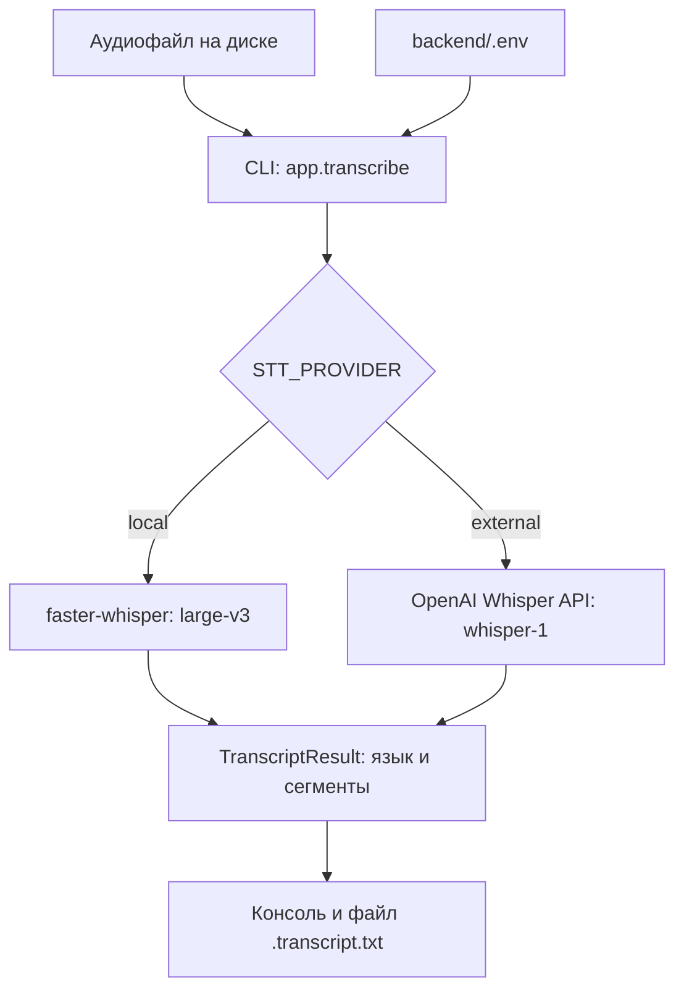

# SOCBrain — автопротоколирование совещаний

Хакатонный проект по кейсу **«Система автопротоколирования совещаний с фиксацией поручений»**.

SOCBrain разрабатывается для секретарей совещаний, руководителей и ответственных за исполнение поручений. Ручное составление протоколов занимает время и создаёт риск потерять или неверно записать задачу, срок и ответственного. Цель проекта — преобразовывать запись совещания в транскрипт, протокол и список поручений для последующего контроля.

**Текущая версия — ранний прототип:** в репозитории есть Python-модуль распознавания аудиофайлов и отдельный статический веб-интерфейс. Они пока не соединены. Автоматическое составление протокола, извлечение поручений и диаризация ещё не реализованы. Данные, статусы и показатели на веб-страницах демонстрационные.

<<<<<<< HEAD
## Сценарий

1. Создать совещание, указать участников, подтвердить уведомление о записи, загрузить аудио/видео.
2. Получить стенограмму с таймкодами и разметкой говорящих (диаризация).
3. Получить саммари и список поручений: суть, ответственный, срок, цитата из стенограммы.
4. Проверить цитаты, ответственных и сроки вручную; исправить имена участников.
5. Выгрузить протокол в PDF/DOCX и отслеживать исполнение поручений (в работе / просрочено / выполнено).
=======
## Что реализовано

| Компонент | Подтверждённые возможности | Состояние |
| --- | --- | --- |
| Обработка аудиофайла | Запуск из командной строки, проверка наличия файла, вызов выбранного провайдера распознавания | Реализовано в [app/transcribe.py](backend/app/transcribe.py) |
| Транскрипт | Сегменты с началом, концом и текстом; вывод определённого языка и расшифровки в консоль; сохранение текста рядом с аудио | Реализовано |
| Выбор провайдера | Переключение между `external` и `local` через `STT_PROVIDER` | Реализовано в [app/stt/__init__.py](backend/app/stt/__init__.py) |
| Внешнее распознавание | Запрос к OpenAI Whisper API, модель `whisper-1`, ответ `verbose_json` с временными отметками сегментов | Реализован адаптер; требует API-ключа |
| Локальное распознавание | Адаптер `faster-whisper` с моделью `large-v3` | Код есть; в исходниках прямо отмечено, что работа на реальном оборудовании ещё не проверена |
| Веб-интерфейс | Страницы входа, дашборда, списка совещаний, карточки совещания, поручений и настроек | Статический прототип |
| Интерактивность интерфейса | Навигация между страницами, переключение вкладок настроек, раскрытие описания в колонке «Суть» списка совещаний | Реализовано на JavaScript |
| Материалы для проверки | Две записи MP3 и два соответствующих документа DOCX | Включены в [Тех_задание/](Тех_задание/) |
>>>>>>> origin/main

Таблицы поручений, саммари и подписи участников в интерфейсе заданы в HTML. Они не являются результатом автоматической обработки аудио текущей версией программы.

<<<<<<< HEAD
- Каждое извлечённое поручение связано с фрагментом транскрипта (цитата).
- Неопределённые ответственные и сроки отмечаются для проверки, а не угадываются: LLM цитирует срок
  дословно, а дату из него («до пятницы», «к пятнадцатому октября») считает детерминированный код.
- Аудиозапись и протокол доступны только уполномоченным участникам.
- Ключи API хранятся в переменных окружения и не добавляются в Git.
=======
## Как работает решение
>>>>>>> origin/main

### Реализованный сценарий распознавания

<<<<<<< HEAD
- [backend/](backend/) — серверная часть: API, конвейер обработки, экспорт протокола.
- [frontend/](frontend/) — пользовательский интерфейс (статические страницы + `js/api.js`).
- [Тех_задание/](Тех_задание/) — техническое задание, тестовые записи и эталонные протоколы.
- [docker-compose.yml](docker-compose.yml) — запуск api, worker и (опционально) локальной LLM.

## Быстрый старт

Нужны Docker и Docker Compose v2; от 4 ГБ RAM (с локальной LLM — от 8 ГБ).

```bash
cp backend/.env.example backend/.env    # выбрать LLM_PROVIDER, при необходимости вписать ключ
docker compose up -d --build            # первая сборка скачивает модели распознавания (~1–2 ГБ)
```

Интерфейс — `http://<хост>:8000`, API — `http://<хост>:8000/docs`.

Проверка на тестовой записи и сверка с эталонным протоколом:

```bash
curl -F "title=Совещание №1" -F "meeting_date=2026-09-21" -F "consent=true" \
     -F "file=@Тех_задание/Совещание №1.mp3" http://localhost:8000/api/meetings
docker compose logs -f worker           # дождаться «meeting … done»
docker compose run --rm -v "$PWD/Тех_задание:/ref" api \
    python -m app.evaluate <id> "/ref/Протокол_совещания№1.docx" --api http://api:8000
```

Тесты: `docker compose run --rm api python -m unittest discover -v tests`.

## Устройство

```
 браузер ─► api (FastAPI + frontend/) ─► SQLite (/data) ◄─ worker ─► LLM: ollama / vLLM / OpenAI / NVIDIA
                                                  очередь     ├─ ffmpeg          → WAV 16 кГц моно
                                                              ├─ STT-провайдер   → слова с таймкодами (RU/KK/смешанная)
                                                              ├─ sherpa-onnx     → кто когда говорил
                                                              ├─ align + lang    → реплики «говорящий: текст», язык реплики
                                                              ├─ LLM             → имена говорящих, поручения, саммари
                                                              └─ dates           → «до пятницы» → 2026-09-25
```

Подробности — в [backend/README.md](backend/README.md).

| Требование ТЗ | Как закрыто |
|---|---|
| Распознавание речи RU / KK / шала-казахский | faster-whisper, язык по фрагментам (`multilingual`); язык каждой реплики определяется по тексту |
| Диаризация и привязка поручения к человеку | sherpa-onnx (pyannote-3.0 + 3D-Speaker, ONNX на CPU); LLM сопоставляет метки с именами, имена сверяются с карточкой совещания |
| Поручения с ответственным и сроком | LLM со структурированным JSON-ответом + детерминированный расчёт дат; без LLM — шаблоны |
| Экспорт PDF / DOCX | `/api/meetings/{id}/export.pdf`, `.docx` |
| Закрытый контур | STT и диаризация локальные, модели встроены в образ; LLM переключается на ollama/vLLM одной настройкой |
| Дашборд статусов, классификация, напоминания | страницы «Дашборд» и «Поручения», срочность и направление поручения, `/api/reminders` |
=======
1. Пользователь выбирает готовую запись совещания на диске.
2. В `backend/.env` задаёт провайдер распознавания.
3. Из каталога `backend` запускает `python -m app.transcribe "путь/к/аудио"`.
4. Программа читает настройки и передаёт файл выбранному провайдеру.
5. Провайдер возвращает язык и сегменты транскрипта с временными отметками.
6. CLI выводит расшифровку в консоль и сохраняет файл `<имя_аудио>.transcript.txt` рядом с записью.
>>>>>>> origin/main

Формат строки результата: `[MM:SS–MM:SS] текст сегмента`. Имя говорящего, структурированные поручения и итоговое саммари в этот файл не добавляются.

<<<<<<< HEAD
Работает сквозной сценарий: загрузка → стенограмма с говорящими → поручения и саммари → протокол PDF/DOCX
→ отслеживание поручений. Страница «Настройки» и вход — пока макеты без бэкенда.

Ограничение ТЗ: облачные провайдеры (`STT_PROVIDER=external`, `LLM_PROVIDER=openai|nvidia`) — только для
разработки на синтетических записях; интерфейс показывает предупреждение, когда данные уходят во внешний API.
=======
### Демонстрация пользовательского интерфейса

В браузере можно пройти по страницам «Дашборд → Совещания → Карточка совещания → Поручения» и посмотреть предполагаемый способ представления результатов. Раздел «Настройки» показывает макеты параметров системы.

Запуск CLI не обновляет страницы. Загрузки аудио через браузер и передачи данных между фронтендом и Python-модулем пока нет.

## Технологии

| Область | Технологии | Как используются |
| --- | --- | --- |
| Бэкенд | Python; в существующей инструкции указан Python 3.12 | Консольная обработка файла, единый интерфейс провайдеров, структуры результата |
| Настройки | `python-dotenv==1.0.1` | Чтение `backend/.env` |
| Внешний STT | `openai==1.109.1`, OpenAI Whisper API, `whisper-1` | Распознавание аудио через `audio.transcriptions.create` |
| Локальный STT | `faster-whisper==1.0.3`, модель `large-v3` | Распознавание на машине, где запущен Python |
| Фронтенд | HTML, CSS, JavaScript | Статические страницы и небольшие обработчики интерфейса |
| Локальный просмотр | Стандартный модуль Python `http.server` | Раздача файлов каталога `frontend` |

Зависимости зафиксированы в [requirements.txt](backend/requirements.txt) и [requirements-local.txt](backend/requirements-local.txt).

В репозитории нет серверного веб-фреймворка, базы данных или подключённой LLM для генерации протокола. Упоминания `pyannote.audio`, локальной LLM, SMTP и корпоративных интеграций в интерфейсе описывают макет: соответствующих реализаций и зависимостей в проекте нет.

## Архитектура проекта

### Обработка аудио



Обе реализации следуют интерфейсу `STTProvider` из [base.py](backend/app/stt/base.py). Метод `transcribe` возвращает `TranscriptResult`, содержащий язык и список `TranscriptSegment(start, end, text)`. Благодаря этому CLI одинаково обрабатывает результат локального и внешнего распознавания.

Фронтенд работает отдельно: браузер получает HTML, CSS и JavaScript от статического HTTP-сервера. Серверного API между ним и модулем STT нет.

### Основные файлы

| Путь | Назначение |
| --- | --- |
| [backend/app/transcribe.py](backend/app/transcribe.py) | Точка входа CLI, форматирование и сохранение транскрипта |
| [backend/app/stt/base.py](backend/app/stt/base.py) | Интерфейс STT и структуры данных |
| [backend/app/stt/__init__.py](backend/app/stt/__init__.py) | Выбор провайдера |
| [backend/app/stt/external_openai.py](backend/app/stt/external_openai.py) | Адаптер OpenAI Whisper API |
| [backend/app/stt/local_faster_whisper.py](backend/app/stt/local_faster_whisper.py) | Локальный адаптер faster-whisper |
| [backend/.env.example](backend/.env.example) | Пример настроек окружения |
| [frontend/](frontend/) | HTML-страницы интерфейса |
| [frontend/css/style.css](frontend/css/style.css) | Общие стили |
| [frontend/js/app.js](frontend/js/app.js) | Переключение вкладок настроек |
| [Тех_задание/](Тех_задание/) | Задание, записи и документы для сравнения |

## Установка и запуск

### 1. Получить проект

Нужны Git, браузер и Python 3.12 — эта версия указана в инструкции бэкенда. Диапазон поддерживаемых версий Python и требования к оборудованию отдельно не зафиксированы.

```bash
git clone https://github.com/BAITC-Hacks/hack-c449499f-socbrain.git
cd hack-c449499f-socbrain
```

Для клонирования приватного репозитория учётная запись GitHub должна иметь доступ. Также можно скачать ZIP и распаковать проект.

### 2. Посмотреть интерфейс

Из корня проекта:

```bash
python3 -m http.server 8000 --bind 127.0.0.1 --directory frontend
```

На Windows:

```bat
py -3.12 -m http.server 8000 --bind 127.0.0.1 --directory frontend
```

Открыть [http://127.0.0.1:8000/](http://127.0.0.1:8000/). Для просмотра интерфейса установка Python-зависимостей бэкенда и API-ключ не нужны. Остановка сервера — `Ctrl+C`.

Страница `login.html` — макет без проверки учётных данных. Для демонстрации можно сразу открыть главную страницу; реальные логины и пароли вводить не следует.

### 3. Подготовить бэкенд

В новом терминале перейти в корень проекта.

**macOS / Linux:**

```bash
cd backend
python3.12 -m venv .venv
source .venv/bin/activate
python -m pip install -r requirements.txt
cp -n .env.example .env
```

Если Python 3.12 доступен как `python3`, при создании окружения можно использовать `python3 -m venv .venv`.

**Windows, командная строка cmd:**

```bat
cd backend
py -3.12 -m venv .venv
.venv\Scripts\activate
python -m pip install -r requirements.txt
if not exist .env copy .env.example .env
```

Следующие команды выполняются из `backend` с активированным окружением.

### 4. Выбрать режим распознавания

**Локальный режим — целевой вариант по техническому заданию.**

Установить дополнительные зависимости:

```bash
python -m pip install -r requirements-local.txt
```

Открыть `backend/.env` и задать:

```dotenv
STT_PROVIDER=local
OPENAI_API_KEY=
```

Провайдер использует `large-v3`, `device="auto"`, `compute_type="auto"` и `beam_size=5`. Эти параметры заданы в [local_faster_whisper.py](backend/app/stt/local_faster_whisper.py), отдельные переменные окружения для них не предусмотрены.

Согласно инструкции бэкенда, веса модели загружаются при первом запуске и занимают несколько гигабайт. Для подготовки окружения нужен доступ к зависимостям и весам. Локальный режим распознавания не отправляет аудио в OpenAI, однако полностью автономная установка для закрытого контура в репозитории не подготовлена. Сам адаптер помечен авторами как ещё не проверенный на реальном оборудовании.

**Внешний режим — имеющийся в коде вариант для разработки.**

Дополнительный `requirements-local.txt` для него не нужен. В `backend/.env`:

```dotenv
STT_PROVIDER=external
OPENAI_API_KEY=YOUR_OPENAI_API_KEY
```

Заменить значение-заглушку собственным ключом. Нужны доступ к OpenAI API и доступная квота для распознавания аудио. Этот режим отправляет аудиофайл внешнему сервису.

> Техническое задание запрещает передачу аудио и текста во внешние облачные API. Поэтому `external` не соответствует этому ограничению и не является вариантом сдачи решения в закрытом контуре. В репозитории он обозначен как временный режим разработки.

Файл `.env` исключён из Git. Ключ следует хранить в локальных настройках бэкенда, не добавляя его в HTML, JavaScript или коммиты.

| Переменная | Значение | Назначение |
| --- | --- | --- |
| `STT_PROVIDER` | `external` или `local` | Выбор провайдера; значение по умолчанию в коде и примере — `external` |
| `OPENAI_API_KEY` | Секретный ключ или пустое значение | Требуется только для `external` |

### 5. Распознать тестовую запись

Из `backend`:

```bash
python -m app.transcribe "../Тех_задание/Совещание №1.mp3"
```

Для второй записи:

```bash
python -m app.transcribe "../Тех_задание/Совещание №2.mp3"
```

При успешном выполнении программа выводит название выбранного провайдера, язык, текст с временными отметками и путь сохранения. В каталоге `Тех_задание` появляются:

- `Совещание №1.transcript.txt`;
- `Совещание №2.transcript.txt`.

Для своей записи передать её путь тем же способом. Повторный запуск для одного файла перезаписывает соответствующий транскрипт.

### Если запуск не удался

| Симптом | Что проверить |
| --- | --- |
| `No module named app` | Команда должна выполняться из каталога `backend` |
| Не найден `dotenv` или `openai` | Активировать окружение и установить `requirements.txt` |
| Не найден `faster_whisper` | Для `STT_PROVIDER=local` установить `requirements-local.txt` |
| `OPENAI_API_KEY не задан` | Проверить ключ в `.env` для `external` или выбрать подготовленный локальный режим |
| `Файл не найден` | Проверить путь; имена с пробелами заключать в кавычки |
| Ошибка загрузки или запуска локальной модели | Проверить доступность весов и совместимость окружения; подтверждённой конфигурации оборудования в репозитории нет |

## Как проверить решение жюри

Проверка состоит из двух независимых сценариев.

### Сценарий A: просмотр интерфейса

1. Запустить статический сервер из раздела установки.
2. Открыть главную страницу и перейти в «Совещания».
3. Нажать на текст в колонке «Суть»: описание раскрывается.
4. Открыть карточку совещания по ссылке с датой, затем перейти в «Поручения».
5. В «Настройках» переключить несколько вкладок.

**Что проверяется:** наличие и связность экранов, отображение примеров протокола и поручений, работа описанных JavaScript-обработчиков. Числа, статусы и содержимое карточки заданы заранее. Поиск, экспорт и изменение настроек не являются действующими функциями.

### Сценарий B: транскрипция записи

1. Установить зависимости и выбрать `STT_PROVIDER=local`, учитывая статус локального адаптера.
2. Запустить обработку `Совещание №1.mp3` командой выше.
3. Убедиться, что сформирован непустой `Совещание №1.transcript.txt` с текстом и временными отметками.
4. Прослушать запись и сравнить распознанные формулировки с соответствующим документом [Протокол_совещания№1.docx](Тех_задание/Протокол_совещания№1.docx). В нём рассматриваются развитие химической промышленности и техника безопасности.
5. Повторить проверку для второй записи и [Протокол_совещания№2.docx](Тех_задание/Протокол_совещания№2.docx), посвящённого производственным показателям направлений.

**Что проверяется:** обработка аудио, сохранение результата и качество распознавания при ручном сравнении. DOCX-документы содержат реплики, саммари и таблицы поручений, но программа их не читает и не создаёт такие документы автоматически.

Критерий технического прохождения этого сценария — получение текстового файла с временными отметками. Измеренных показателей точности, скорости и результатов испытаний в репозитории нет; наличие адаптера не заменяет проверку на выбранной машине.

## Данные и интеграции

### Входные материалы

В [Тех_задание/](Тех_задание/) находятся:

| Файл | Назначение |
| --- | --- |
| [HackAlem AI_ Система автопротоколирования совещаний с фиксацией поручений.docx](<Тех_задание/HackAlem AI_ Система автопротоколирования совещаний с фиксацией поручений.docx>) | Описание кейса, обязательные функции, ограничения и критерии оценки |
| [Совещание №1.mp3](<Тех_задание/Совещание №1.mp3>) | Первая тестовая аудиозапись |
| [Совещание №2.mp3](<Тех_задание/Совещание №2.mp3>) | Вторая тестовая аудиозапись |
| [Протокол_совещания№1.docx](Тех_задание/Протокол_совещания№1.docx) | Документ для ручного сравнения с первой записью |
| [Протокол_совещания№2.docx](Тех_задание/Протокол_совещания№2.docx) | Документ для ручного сравнения со второй записью |

CLI принимает путь к локальному файлу. Он не подключается к конференции, не принимает live-поток и не записывает микрофон.

### Подключения

- **OpenAI Whisper API:** в коде есть адаптер внешнего распознавания; включается через `STT_PROVIDER=external`.
- **faster-whisper:** адаптер локального распознавания; включается через `STT_PROVIDER=local`.
- **Zoom, Teams, Google Meet, СЭД, SMTP, SSO и LDAP:** действующих интеграций в репозитории нет. Часть из них упоминается в техническом задании или макетах настроек.

Согласно техническому заданию, реальные записи для демонстрации должны быть анонимизированы. Автоматическая анонимизация в текущем коде не реализована.

## Ограничения текущей версии

- **Нет сквозного веб-сценария:** интерфейс и CLI не связаны; нет серверных маршрутов загрузки аудио, обработки и получения результата.
- **Нет диаризации и голосовой идентификации:** модель результата содержит время и текст, но не идентификатор говорящего. Подписи участников в HTML — демонстрационные.
- **Нет генерации протокола:** извлечение поручений, определение ответственных и сроков, саммари и проверка секретарём программно не реализованы.
- **Нет экспорта PDF/DOCX:** кнопки в карточке совещания — ссылки-заглушки. CLI сохраняет только текстовый транскрипт.
- **Нет авторизации и разграничения доступа:** форма входа просто переходит на дашборд и передаёт поля методом GET. Сессии, роли, MFA и журнал доступа показаны только в макетах.
- **Нет хранения бизнес-данных:** отсутствуют база данных, обновление статусов поручений, сохранение настроек, напоминания и рассылки. Автоматического удаления аудио через 30 дней, указанного в макете карточки, в коде нет.
- **Локальный STT требует проверки:** исходники помечают адаптер как непроверенный на реальном оборудовании. Требования к CPU, GPU, памяти и измерения производительности не представлены.
- **Языковое качество не подтверждено:** русский, казахский и смешанная речь требуются по ТЗ, но результатов испытаний для этих языков нет. Статусы «включён» в интерфейсе не являются подтверждением качества.
- **Нет обработки длинных записей по частям:** файл передаётся провайдеру одним вызовом. В коде не заданы ограничения размера, очередь заданий и восстановление обработки после сбоя.
- **Нет автоматизированных тестов и инфраструктуры развёртывания:** в репозитории отсутствуют автоматизированные проверки, CI-конфигурация, Dockerfile и Docker Compose.

Текущая версия покрывает начальный этап обработки записи и демонстрацию интерфейса. Полное выполнение обязательного минимума кейса пока не подтверждено реализацией.

## Развёрнутая версия

Ссылка на опубликованное приложение в репозитории не указана. GitHub Pages для репозитория не включён.

Для просмотра интерфейса используется локальный адрес [http://127.0.0.1:8000/](http://127.0.0.1:8000/) после запуска команды из раздела установки. Этот адрес доступен на машине, где запущен сервер.
>>>>>>> origin/main
