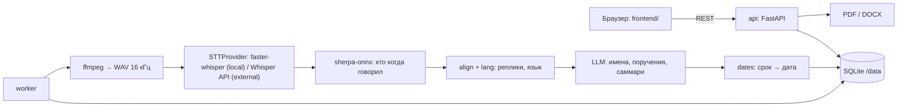

# SOCBrain — автопротоколирование совещаний

Хакатонный проект по кейсу **«Система автопротоколирования совещаний с фиксацией поручений»**.

SOCBrain разрабатывается для секретарей совещаний, руководителей и ответственных за исполнение поручений. Ручное составление протоколов занимает время и создаёт риск потерять или неверно записать задачу, срок и ответственного. Система превращает запись совещания в стенограмму с говорящими, протокол и список поручений для последующего контроля.

**Текущая версия — рабочий прототип:** запись загружается через веб-интерфейс, распознаётся и размечается по говорящим локально, из стенограммы выделяются поручения со сроками и ответственными, протокол выгружается в PDF/DOCX, исполнение поручений отслеживается на дашборде. Вход в систему и коннекторы к Zoom/Teams/СЭД пока не реализованы — см. [ограничения](#ограничения-текущей-версии).

## Структура репозитория

- [backend/](backend/) — серверная часть: API, конвейер обработки, экспорт протокола. Подробности — [backend/README.md](backend/README.md).
- [frontend/](frontend/) — пользовательский интерфейс (статические страницы + `js/api.js`, работающий с API).
- [Тех_задание/](Тех_задание/) — техническое задание, тестовые записи и эталонные протоколы.
- [docker-compose.yml](docker-compose.yml) — запуск api, worker и (опционально) локальной LLM.

## Что реализовано

| Требование ТЗ | Реализация | Состояние |
| --- | --- | --- |
| Распознавание речи | faster-whisper в контейнере worker; модель встроена в образ | Реализовано, проверено на тестовых записях |
| Русский / казахский / шала-казахский | Язык определяется по фрагментам (`multilingual`); язык каждой реплики — по тексту (казахские буквы и служебные слова) | Реализовано; на русских записях проверено, казахских тестовых записей в наборе нет |
| Диаризация и привязка поручения к человеку | sherpa-onnx (сегментация pyannote-3.0 + эмбеддинги 3D-Speaker, ONNX на CPU); LLM сопоставляет метки с именами; имена сверяются с карточкой совещания | Реализовано; качество разметки — главное слабое место (см. ограничения) |
| Поручения с ответственным и сроком | LLM со структурированным JSON-ответом: суть, кому, срок дословно, цитата, срочность, направление. Дату из срока («до пятницы», «к пятнадцатому октября», «жұмаға дейін») считает детерминированный код. Без LLM — шаблон «…, ответственный X, срок Y» | Реализовано |
| Саммари | LLM: обзор, темы с ключевыми фактами, решения | Реализовано, требует подключённой LLM |
| Экспорт PDF / DOCX | Протокол: участники, саммари, таблица поручений, стенограмма | Реализовано |
| Закрытый контур | STT и диаризация локальные, модели в образе; LLM — Ollama / vLLM / NVIDIA NIM в своей сети одной настройкой | Реализовано; облачные LLM — только режим разработки |
| Дашборд статусов поручений | В работе / просрочено / выполнено, ближайшие сроки, отметка выполнения | Реализовано |
| Классификация поручений | Срочность и направление | Реализовано (LLM) |
| Напоминания о сроках | `/api/reminders`, окно напоминания в настройках | Список есть; почтовая рассылка — следующий шаг |
| Уведомление участников о записи | Загрузка невозможна без отметки «участники уведомлены» | Реализовано |
| Настройки | Тема и плотность, почта (с проверкой SMTP), ИИ-провайдер (с проверкой подключения), внешние системы, распознавание, диаризация, хранение аудио | Реализовано; разделы безопасности и пользователей — макеты до внедрения входа |

## Как работает решение

1. Секретарь создаёт совещание: тема, дата, участники («Имя Отчество — должность»), отметка об уведомлении, файл записи.
2. Worker конвертирует запись в WAV 16 кГц, распознаёт речь с пословными таймкодами. Подсказкой служат тема, имена участников и словарь из настроек.
3. Диаризация определяет, кто когда говорил; каждое слово относится к говорящему с наибольшим перекрытием, из слов собираются реплики. «Голоса» с парой секунд речи (кашель, эхо) сводятся к соседям.
4. Имена, искажённые распознаванием, исправляются по карточке участников («Тимур Булотович» → «Тимур Болатович»).
5. LLM определяет, кто есть кто, выделяет поручения и пишет саммари. Сроки переводятся в даты относительно даты совещания; неназванный срок остаётся пустым и помечается «не указан», а не угадывается.
6. Секретарь проверяет карточку: цитата у каждого поручения, правка имён, дат и статусов. Протокол выгружается в PDF/DOCX.

«Переанализировать» повторяет только шаги 4–5 по готовой стенограмме — секунды вместо повторного распознавания.

## Технологии

| Область | Технологии |
| --- | --- |
| API и фронтенд | Python 3.12, FastAPI, SQLite; HTML/CSS/JavaScript без сборки |
| Распознавание речи | faster-whisper (CTranslate2), по умолчанию `small`, int8 на CPU; альтернативно OpenAI Whisper API (разработка) |
| Диаризация | sherpa-onnx: pyannote-segmentation-3.0 + 3D-Speaker ERes2Net |
| Анализ стенограммы | Любой OpenAI-совместимый `/chat/completions`: Ollama, vLLM, NVIDIA NIM / API Catalog, OpenAI |
| Экспорт | python-docx, reportlab (шрифт DejaVu — казахские буквы) |
| Развёртывание | Docker, Docker Compose |

## Архитектура проекта



Интерфейс `STTProvider` ([base.py](backend/app/stt/base.py)) сохранён: провайдеры возвращают `TranscriptResult` с сегментами и пословными таймкодами, остальной конвейер не знает, кто распознавал речь.

### Основные файлы

| Путь | Назначение |
| --- | --- |
| [backend/app/api/main.py](backend/app/api/main.py) | REST API, раздача фронтенда, экспорт, настройки |
| [backend/app/worker.py](backend/app/worker.py) | Очередь обработки, очистка аудио по сроку хранения |
| [backend/app/pipeline/](backend/app/pipeline/) | Конвейер: audio, diarization, align, lang, extract, llm, dates, runner |
| [backend/app/stt/](backend/app/stt/) | Провайдеры распознавания |
| [backend/app/config.py](backend/app/config.py) | Настройки: `.env` + значения из интерфейса, шаблоны LLM-провайдеров |
| [backend/app/evaluate.py](backend/app/evaluate.py) | Сверка поручений с эталонным протоколом |
| [backend/app/transcribe.py](backend/app/transcribe.py) | CLI: распознать один файл без веб-интерфейса |
| [frontend/js/api.js](frontend/js/api.js) | Связь страниц с API |
| [backend/tests/](backend/tests/) | Автотесты: сроки, язык, конвейер, настройки |

## Установка и запуск

### 1. Получить проект

```bash
git clone https://github.com/BAITC-Hacks/hack-c449499f-socbrain.git
cd hack-c449499f-socbrain
```

### 2. Запустить

Нужны Docker и Docker Compose v2, от 4 ГБ RAM (с локальной LLM — от 8 ГБ).

```bash
cp backend/.env.example backend/.env
docker compose up -d --build
```

Первая сборка скачивает зависимости и модели распознавания (~1–2 ГБ) и занимает 10–15 минут; дальше worker работает без интернета. Интерфейс — [http://localhost:8000](http://localhost:8000), описание API — [http://localhost:8000/docs](http://localhost:8000/docs).

### 3. Подключить LLM

Без LLM система работает, но выделяет только явные поручения («…, ответственный X, срок Y») и не пишет саммари. Провайдер выбирается в **Настройки → Распознавание речи и ИИ** или в `backend/.env`:

| Вариант | Где | `backend/.env` |
| --- | --- | --- |
| Ollama — локально, для закрытого контура | в Docker рядом | `LLM_PROVIDER=ollama`, затем `docker compose --profile local-llm up -d` |
| NVIDIA NIM — локально на GPU-сервере | своя сеть | `LLM_PROVIDER=nvidia`, `LLM_BASE_URL=http://<сервер>:8000/v1` |
| NVIDIA API Catalog — облако, разработка | build.nvidia.com | `LLM_PROVIDER=nvidia`, `NVIDIA_API_KEY=nvapi-…` |
| OpenAI — облако, разработка | api.openai.com | `LLM_PROVIDER=openai`, `OPENAI_API_KEY=…` |

После правки `.env`: `docker compose up -d`; ключ из интерфейса действует сразу. Кнопка «Проверить подключение» в настройках проверяет адрес, ключ, модель и структурированный ответ на синтетическом запросе.

> Техническое задание запрещает передачу аудио и текста во внешние облачные API. Облачные провайдеры — только для разработки на синтетических записях; интерфейс показывает предупреждение, пока текст уходит наружу.

Ключ можно вставить прямо в **Настройки → Распознавание речи и ИИ** (или задать в `backend/.env`, исключённом из Git). Введённый в интерфейсе ключ хранится в базе зашифрованным (мастер-ключ — `SECRETS_KEY` или файл `/data/.secrets_key`), обратно не показывается — только «задан, …ab12» — и привязан к адресу провайдера: если адрес LLM сменить на чужой, ключ туда не отправится.

### Если запуск не удался

| Симптом | Что проверить |
| --- | --- |
| Страница не открывается | `docker compose ps` — оба контейнера `Up`; `docker compose logs api` |
| Совещание долго «обрабатывается» | `docker compose logs -f worker`; на 3–4 ядрах CPU запись 4,5 мин обрабатывается ~9 мин |
| «LLM не подключена» в карточке | Настройки → Распознавание речи и ИИ → «Проверить подключение» |
| Сбой при сборке worker | Нужен интернет для первой сборки (pip, модели) |

Запуск распознавания без Docker, как раньше: `cd backend && python -m app.transcribe "../Тех_задание/Совещание №1.mp3"` (см. [backend/README.md](backend/README.md)).

## Как проверить решение жюри

### Сценарий A: сквозная обработка через интерфейс

1. Открыть «Совещания» → «Новое совещание»: тема, дата `2026-09-21`, файл `Тех_задание/Совещание №1.mp3`, участники из [Протокол_совещания№1.docx](Тех_задание/Протокол_совещания№1.docx), отметка об уведомлении.
2. Дождаться статуса «готово» — страница обновляется сама.
3. В карточке: саммари, поручения с цитатами и сроками, участники с метками диаризации, стенограмма по репликам с выделенным председателем.
4. Выгрузить PDF и DOCX; в «Поручениях» отметить поручение выполненным — дашборд пересчитается.
5. В «Настройках» переключить тему и плотность, проверить подключение LLM.

### Сценарий B: сверка с эталонным протоколом

```bash
docker compose run --rm -v "$PWD/Тех_задание:/ref" api \
    python -m app.evaluate <id совещания> "/ref/Протокол_совещания№1.docx" --api http://api:8000
```

Скрипт читает таблицы поручений из эталона и показывает найденные, пропущенные и лишние поручения, верность ответственного и срока.

### Автотесты

```bash
docker compose run --rm api python -m unittest discover -v tests
```

## Измеренные результаты

Совещание №1 (4 мин 34 с, русский), ноутбук AMD Ryzen 5 7520U, ВМ 3 vCPU / 4 ГБ, faster-whisper `small` int8:

| Показатель | Без LLM | С LLM |
| --- | --- | --- |
| Время обработки | ~9 мин | + время ответа LLM |
| Найдено поручений из эталона | 3 из 10 | ещё не измерено |
| Лишних поручений | 0 | — |
| Верный ответственный / срок у найденных | 100% / 100% | — |

Без LLM находятся только явные формулировки; неявные поручения («до пятницы разберитесь с подрядчиком») требуют LLM.

## Данные и интеграции

### Входные материалы

| Файл | Назначение |
| --- | --- |
| [HackAlem AI_ Система автопротоколирования совещаний с фиксацией поручений.docx](<Тех_задание/HackAlem AI_ Система автопротоколирования совещаний с фиксацией поручений.docx>) | Описание кейса, обязательные функции, ограничения и критерии оценки |
| [Совещание №1.mp3](<Тех_задание/Совещание №1.mp3>), [Совещание №2.mp3](<Тех_задание/Совещание №2.mp3>) | Тестовые аудиозаписи |
| [Протокол_совещания№1.docx](Тех_задание/Протокол_совещания№1.docx), [Протокол_совещания№2.docx](Тех_задание/Протокол_совещания№2.docx) | Эталоны для `app.evaluate` |

Принимаются аудио и видео (mp3, wav, m4a, ogg, flac, webm, mp4, mkv, mov). Подключение к конференции и live-поток пока не реализованы.

### Подключения

- **Распознавание:** faster-whisper локально (`STT_PROVIDER=local`) или OpenAI Whisper API (`external`, разработка).
- **LLM:** Ollama, vLLM, NVIDIA NIM / API Catalog, OpenAI — шаблоны в настройках.
- **Почта (SMTP):** параметры и проверка подключения в настройках; пароль — `SMTP_PASSWORD` в `.env`. Рассылка напоминаний — следующий шаг.
- **Zoom, Teams, Google Meet, СЭД:** параметры подключения хранятся в настройках; сами коннекторы не реализованы.

Согласно ТЗ, реальные записи для демонстрации должны быть анонимизированы; автоматическая анонимизация не реализована.

## Ограничения текущей версии

- **Нет авторизации и разграничения доступа:** форма входа — макет; любой, у кого есть доступ к адресу, видит протоколы и может менять настройки и ключи (прочитать сохранённый ключ нельзя). Разделы настроек «Безопасность» и «Пользователи» — макеты.
- **Диаризация неточная:** на Совещании №1 пять участников размечены как три голоса, председателю приписываются короткие ответы других. Имена исправляются вручную в карточке. Следующий шаг — подбор модели эмбеддингов и порога по `app.evaluate`.
- **Качество на казахской и смешанной речи не измерено:** в тестовом наборе нет таких записей.
- **Поручения и саммари зависят от LLM:** без неё — только явные формулировки. Локальная LLM требует от 8 ГБ RAM (лучше GPU).
- **Нет рассылки и коннекторов:** напоминания по почте, приём записей из Zoom/Teams/Meet и выгрузка в СЭД — параметры есть, реализации нет.
- **Нет утверждения протокола секретарём** как отдельного статуса: правки сохраняются сразу.
- **Длинные записи** обрабатываются одним заданием; прогресса внутри этапа нет. Очередь переживает перезапуск worker.

## Развёрнутая версия

Публичной развёрнутой версии нет. Стенд разворачивается командой из раздела «Установка и запуск» на любой машине с Docker.
